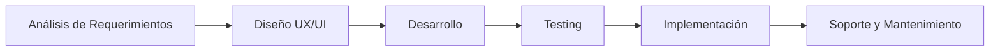

# OKRI - Soluciones Tecnológicas Integrales

  <strong>Transformamos ideas en soluciones digitales</strong>

## 🚀 Quiénes Somos

Somos una empresa dedicada a la entrega de soluciones tecnológicas que permiten a nuestros clientes desarrollar su negocio y mejorar procesos. En OKRI nos especializamos en el desarrollo web y aplicaciones personalizadas, ayudando a empresas y emprendedores a materializar sus ideas en el mundo digital.

## 💼 Nuestros Servicios

## 🔧 Tecnologías

Trabajamos con las tecnologías más actuales y demandadas del mercado:

- **Frontend**: 
  
  

- **Backend**: 
  
  

- **Base de Datos**: 
  
  
  

## 📊 Proyectos 

Próximamente compartiremos nuestros casos de éxito y proyectos destacados.

## 📈 Proceso de Desarrollo

## 🤝 Cómo Trabajamos

1. **Análisis y Planificación**: Entendemos tus necesidades y objetivos de negocio.
2. **Diseño y Prototipado**: Creamos wireframes y maquetas para visualizar la solución.
3. **Desarrollo Ágil**: Implementamos la solución con metodologías ágiles.
4. **Pruebas y Optimización**: Realizamos pruebas exhaustivas antes de la entrega.
5. **Lanzamiento y Soporte**: Te acompañamos en el lanzamiento y brindamos soporte continuo.

## 📞 Contáctanos

## 📄 Licencia

Este proyecto está bajo la Licencia MIT - vea el archivo [LICENSE](LICENSE) para más detalles.

---

  
© 2024 OKRI - Todos los derechos reservados

  
Desarrollado con ❤️ en Chile

